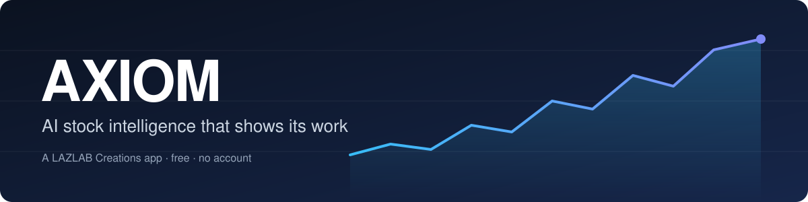
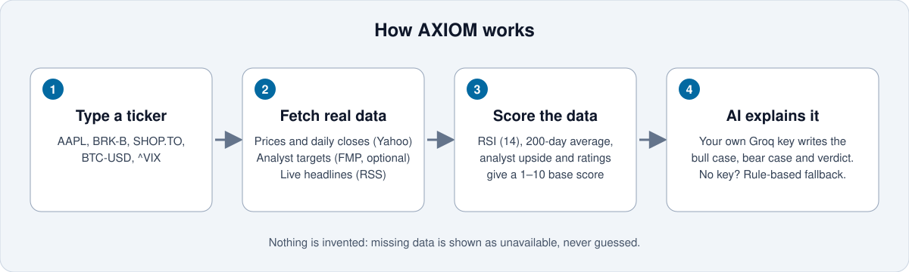
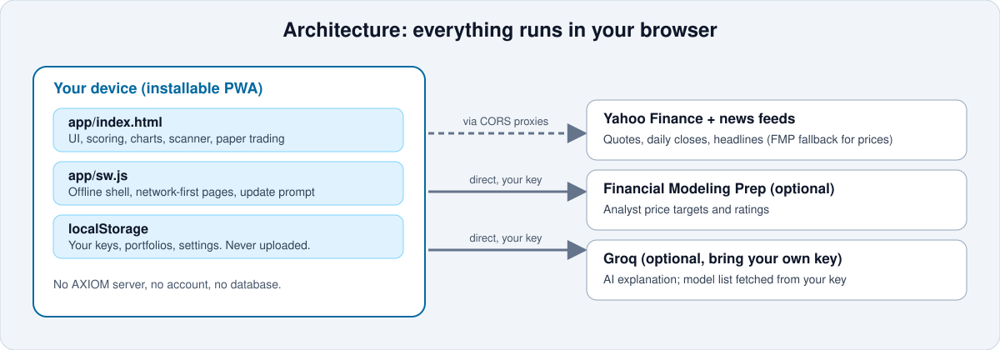

<p align="center"></p>

# AXIOM

AI stock analysis that shows its work. Type a ticker and AXIOM pulls prices, analyst targets and current headlines, scores the stock 1–10 from the numbers, and has an AI explain the bull case and the bear case. It also includes a market scanner, watchlists, side-by-side comparison, earnings, and paper-trading portfolios. Free, no account, runs entirely in your browser.

AXIOM is for research and paper trading only. It is not financial advice.

## Live

| | URL |
|---|---|
| Landing page | https://johnlaz.github.io/axiom/ |
| App | https://johnlaz.github.io/axiom/app/ |

Install the app from its page: **Add to Home Screen** on iPhone, or the install icon in Chrome/Edge.



## Repo layout

```
/index.html        Landing page
/README.md         This file
/docs/             README visuals (SVG only)
/app/
    index.html     The whole app (single file)
    manifest.json  PWA manifest (192 + 512 icons, screenshots)
    sw.js          Service worker (offline shell, version-stamped cache)
    icon-192.png
    icon-512.png
    shot-phone-1.png, shot-phone-2.png, shot-wide.png
```

The landing page is a plain page and is not installable. Only `/app/` is the PWA, so its scope is `/app/`.

## Data sources and charts

| Data | Source | Notes |
|---|---|---|
| Quotes, daily closes (1 year) | Yahoo Finance chart API | Reached through public CORS proxies. Prices can be delayed by about 15 minutes. |
| Price fallback | Financial Modeling Prep | Used only if Yahoo fails and you saved an FMP key. The "Data:" chip shows which source was used. |
| Analyst targets and ratings | Financial Modeling Prep (optional key) | Shown as unavailable without a key, never estimated. |
| Headlines | Yahoo Finance, MarketWatch, CNBC RSS | Real headlines only. The AI classifies them and never writes them. |
| Index tiles | `^GSPC`, `^NDX`, `^DJI`, `^RUT`, `^VIX` | If an index cannot be loaded, the tile falls back to its ETF (SPY, QQQ, DIA, IWM) and says so. |

Charts use real calendar ranges (1M is 30 calendar days), show dates, high, low and the period change, and give a hover or touch readout of date and price. The sentiment gauge is a simple RSI plus 200-day-average measure on SPY. It is not CNN's Fear & Greed index.

## AI and model setup

AXIOM uses Groq with your own API key. Open Settings, paste the key and save. The app then asks Groq which chat models your key can use, drops speech, guard and embedding models, and shows the newest few in a picker. Use **Refresh** to re-pull the list. If the selected model is retired, AXIOM re-pulls the list and retries once. Without a key, scores still work from the numbers and the AI commentary is skipped.

## Data and privacy

- There is no AXIOM server, account or database.
- Your keys, portfolios and settings stay in your browser's local storage. Settings can be exported to a JSON file.
- Groq and FMP are called directly from your browser, so keys never pass through a proxy.
- Yahoo and RSS requests go through third-party public proxies, which can see the ticker symbols requested but never your keys.



## Deploy and update

Deploy with GitHub Pages from the `main` branch root. To ship a new version:

1. Change `VERSION` in `app/sw.js` (for example `axiom-app-v3.2`).
2. Change `AX_VERSION` in `app/index.html` to match (for example `3.2`). It appears next to the logo and in Settings.
3. Commit and push. Open installs show a "new version ready" bar and reload on tap.

## Changelog

**v3.1 (2026-10-08)**
- Fixed the price chart: it was clipped on phones, mislabeled its ranges, and colored the line by today's change instead of the period.
- Added dates, high/low, period change and a hover/touch readout to the chart.
- Index tiles now show real index levels, with an honest ETF fallback.
- Added an FMP price fallback when Yahoo is unreachable.
- Added a visible version stamp and a "new version ready" prompt.
- Flattened the repo to `index.html`, `README.md`, `docs/` and `app/`; removed duplicate icons, favicon, root manifest and root service worker.
- Manifest now has 192 and 512 icons and screenshots. Existing installs may need to be removed and re-added.

© 2026 LAZLAB Creations. All Rights Reserved. · lazlab.io@gmail.com
